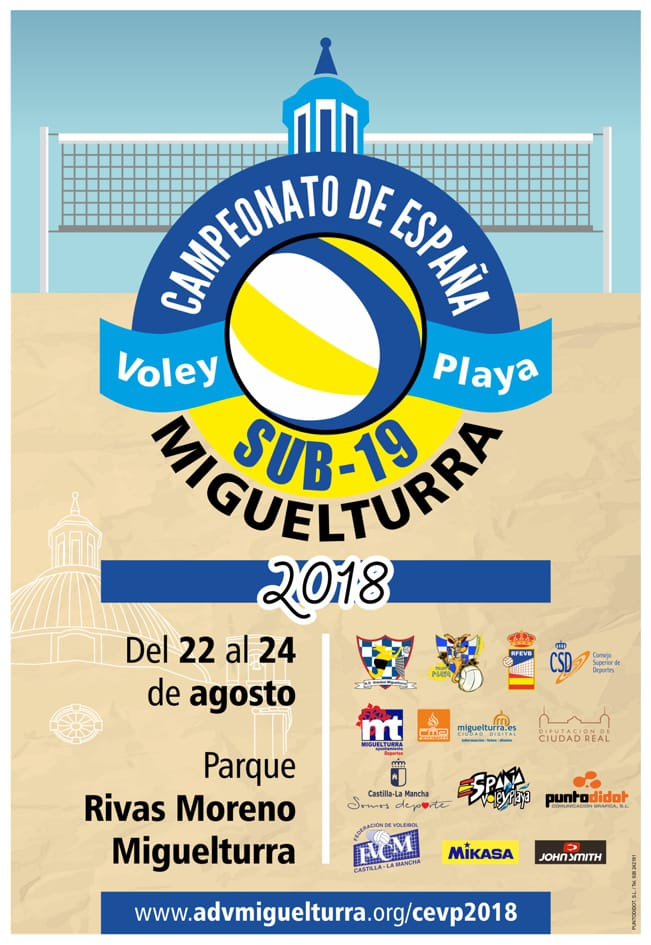

<aside>
<h2>Secciones</h2>

<!--p>En breve iremos añadiendo más información. Mientras tanto, estad
pendientes de nuestras cuentas en <a
href="https://www.twitter.com/advmiguelturra">Twitter</a> y <a
href="https://www.facebook.com/advmiguelturra">Facebook</a></p-->

<a href="#participantes">Participantes</a>

<!-- 
<a href="#grupos">Grupos</a>
 -->
<!-- 
<a href="#resultados">Resultados</a>
 -->

<a href="#fotos">Fotos</a>

<!-- 
<a href="#streaming">Streaming</a>
 -->
<!-- 
<a href="#instalaciones">Instalaciones</a>
 -->

</aside>

# Campeonato de España sub19 de Voley-Playa 2018

## Cuadro de Competición

[ Sub 19 Masculino](sub19m.pdf)
