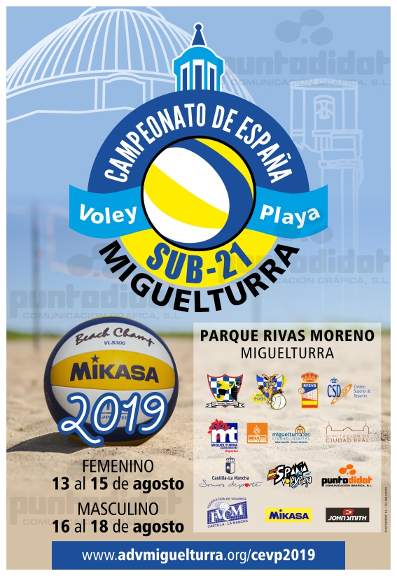

<aside>
<h2>Secciones</h2>

En breve iremos añadiendo más información. Mientras tanto, estad
pendientes de nuestras cuentas en <a
href="https://www.twitter.com/advmiguelturra">Twitter</a> y <a
href="https://www.facebook.com/advmiguelturra">Facebook</a>

<!--

<a href="#cuadro-de-competición">Cuadro de Competición</a>

<a href="#participantes">Participantes</a>

<a href="#resultados">Resultados</a>

<a href="#fotos">Fotos</a>

<a href="#streaming">Streaming</a>

<a href="#instalaciones">Instalaciones</a>

-->
</aside>

# Campeonato de España de Voley-Playa Sub21 :: 2019

## Dossier Informativo

Puedes descargar el [dossier informativo](DossierParticipantes.pdf)
para jugadores, con toda la información relevante para los
participantes.

<!-- ## Cuadro de Competición -->

<!-- Por confirmar -->
<!-- <\!-- [ Cuadro Sub 19 Masculino](http://rfevb.com/RFEVB/Files/vplaya/cevp/sub19_clubes/2018/sub19m.pdf) -\-> -->
