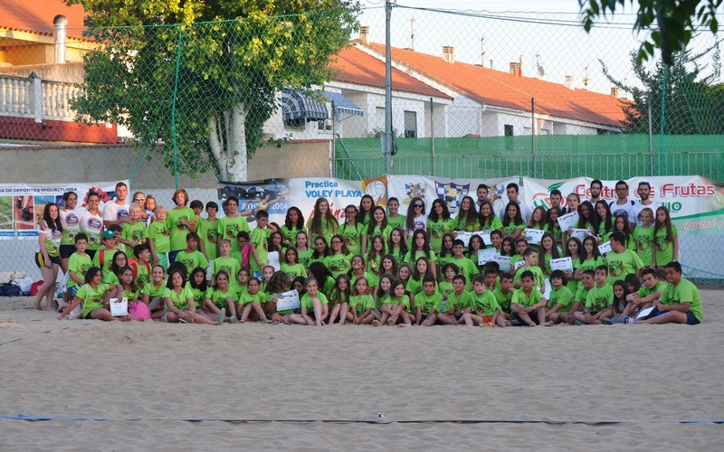

## Actividades

### Presentación
   |   |   
---|---|---
 |  | 

El primer día del Clínic por la tarde se realiza la presentación del
mismo, donde los chicos y chicas se reparten en grupos junto a los
monitores asignados, se les explica el funcionamiento del Clínic y se
les entrega el material.

### Entrenos
   |   |   
---|---|---
 |  | 

Los entrenamientos son la base del Clínic, se realizan tanto en pista
de voley playa como de voleibol y están adaptados para el nivel y
categoría de todos los participantes, los nuevos en este deporte
trabajarán desde la base mientras que los más experimentados podrán
perfeccionar su técnica.

### Almuerzo
   |   |   
---|---|---
 |  | 

A media mañana monitores y alumnos reponen fuerzas con un almuerzo
saludable para poder continuar disfrutando.

### Gymkhanas y Juegos
   |   |   
---|---|---
 |  | 

Divertirse también es imprescindible en el Clínic, por ello los
monitores y monitoras organizan juegos y competiciones para el
disfrute de los participantes.

### Piscina
   |   |   
---|---|---
 |  | 

Tras el duro trabajo de entrenamiento, todos los días terminamos con
un merecido descanso en la Piscina Municipal, donde nos refrescamos y
comentamos lo mejor de la mañana.

### Playa Park
   |   |   
---|---|---
 |  | 

Para cerrar debidamente el Clínic, cada año nos vamos de excursión con
todo incluido al parque acuático PlayaPark en Ciudad Real.

### Acto de Clausura
   |   |   
---|---|---
 |  | 

El último día por la tarde se realiza la tradicional ceremonia de
clausura a la que pueden asistir las familias y en la que se lleva a
cabo la entrega de diplomas.
