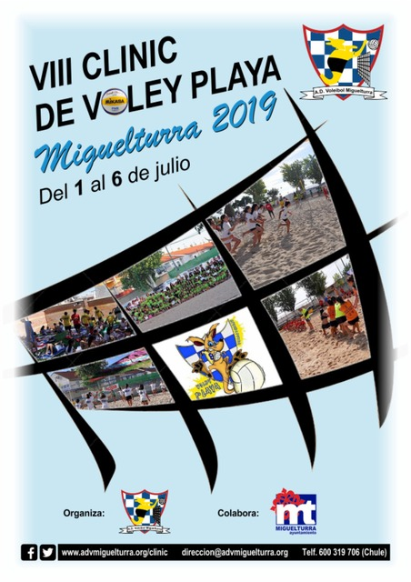

# Clinic de Voley-Playa 2018

<!--aside>
  <h3>Contenidos</h3>
  
	<a href="#inscripcion">Inscripción</a>

  
	<a href="#horario">Horario</a>

  
	<a href="#equipo">Equipo</a>

  
	<a href="#actividades">Actividades</a>

  
	

  
	<a href="#visitas">Visitas</a>

</aside-->

<!-- El ADV Miguelturra vuelve a organizar, por séptimo año consecutivo, el -->
<!-- Clinic de Voley-Playa. Orientado a chavales nacidos entre 2003 y 2009, -->
<!-- el clínic les ofrece más de una semana de actividades deportivas y de -->
<!-- recreo, donde los nuevos en este deporte aprenderán las nociones -->
<!-- básicas del voley playa mientras los más experimentados podrán -->
<!-- perfeccionar su técnica, todo ello a la vez que se divierten con los -->
<!-- juegos y actividades organizados por -->
<!-- nuestros monitores. -->

<!-- El clinic tendrá lugar del 6 al 15 de Julio, con descanso el -->
<!-- domingo 9. La inauguración se celebrará el día 6, a las 20:00 horas en -->
<!-- el Parque Rivas Moreno. El sábado 15 tendrá lugar la fiesta de -->
<!-- despedida en el parque acuático Playa Park de Ciudad Real, y -->
<!-- posteriormente el acto de clausura a las 20:00 horas en el Parque -->
<!-- Rivas Moreno. -->

