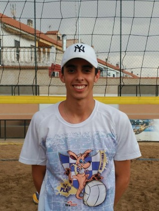
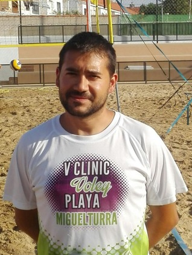
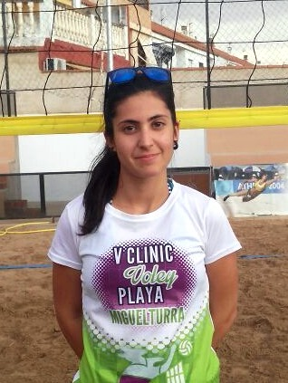
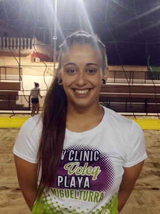
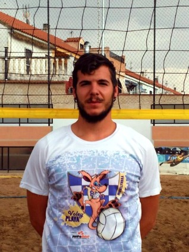
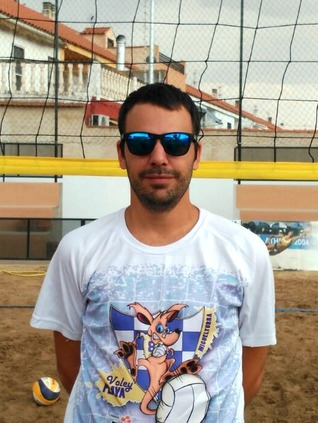
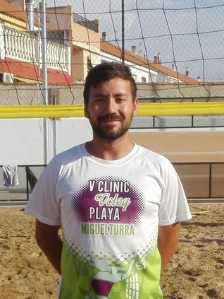
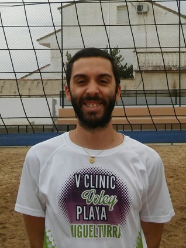
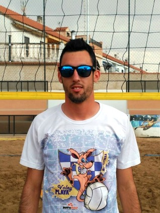
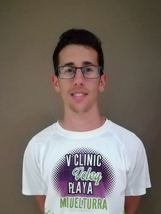

## Equipo Técnico

### Dirección

  
  <strong>Manu León :: Director</strong>
  

  

Jugador formado en la cantera del ADV Miguelturra y
actual miembro del equipo senior B. Entrenador de
nivel II con formación diversa es el actual técnico de
los equipos cadete femenino B y juvenil femenino B. A
pesar de su juventud, cuenta con gran experiencia en
coordinación de actividades deportivas.

  
  <strong>Jesús Nieto (Chule) :: Supervisor y responsable de Alevín Femenino B</strong>
  

  

Entrenador de nivel II con experiencia en
competiciones nacionales, actualmente es el
coordinador de la Escuela de Voleibol de Miguelturra y
miembro activo de la directiva del club siendo a la
vez entrenador de los equipos juvenil masculino e
infantil masculino (actuales subcampeones de CLM) del
ADV Miguelturra, también ha formado parte del equipo
técnico de las selecciones de Castilla-La Mancha. Como
jugador ha sido formado en las Escuelas de Miguelturra
habiendo sido posteriormente miembro del equipo
absoluto en numerosas temporadas.
  

  <strong>Laura Mora :: Soporte Técnico y responsable de Alevín Masculino A</strong>
  

  

Alumna de nuestra escuela desde temprana edad, es
actualmente jugadora del equipo senior, habiendo sido
campeona de Castilla-La Mancha en Voley Playa en tres
ocasiones participando en los correspondientes
campeonatos nacionales. Como entrenadora se ha formado
en las escuelas de Miguelturra siendo entrenadora de
nivel I y actual entrenadora del equipo infantil
femenino A. En Voley Playa viajó el pasado año al
Campeonato de España sub-15 con el equipo femenino del
ADV Miguelturra y con el cual este año han vuelto a
lograr la clasificación.
  

### Responsables de Grupo

  <strong>Marta Nieto :: Benjamín Femenino e Iniciación</strong>
  

  

Formada en las categorías inferiores de nuestro club y
actual capitana del equipo Juvenil Femenino A. Es
entrenadora de voleibol de nivel I estando actualmente
en formación en nuestra escuela como entrenadora
asistente en el equipo Alevín Masculino A con el que
este año participa en el Campeonato de España.
  

  
  <strong>Juan Antonio Brígido :: Benjamín Masculino</strong>
  

  

Formado como jugador en la cantera del ADV
Miguelturra, es jugador habitual de nuestros equipos
senior y participó en el Campeonato de España de Voley
Playa sub-21 en 2016 como campeón de Castilla-La
Mancha. Como entrenador ha recibido formación en
nuestras escuelas siendo entrenador de nivel I y
formando parte actualmente del equipo técnico de Prado
Marianistas de Ciudad Real como entrenador del equipo
cadete femenino.
  

  
  <strong>Fran González :: Alevín Femenino C</strong>
  

  

Formado en la cantera del CV Campus Universitario de
Ciudad Real, llegó a nuestro club en su etapa juvenil
tras haber formado parte en varias ocasiones de la
Selección de Castilla-La Mancha y participado en
numerosos campeonatos nacionales, actualmente forma
parte del equipo senior de nuestro club. Es entrenador
de nivel I y se encuentra en formación en nuestra
escuela como entrenador asistente del equipo Infantil
Femenino A. El pasado año formó parte del equipo
técnico que se desplazó con el equipo infantil
femenino al Campeonato de España de Voley Playa de
Lorca.
  

  
  <strong>Javier Nieto :: Alevín Femenino A</strong>
  

  

Entrenador de nivel I formado como jugador y
entrenador en nuestras escuelas siendo actualmente
entrenador del equipo cadete masculino y miembro del
equipo senior. Monitor del Clinic de Voley Playa desde
su primera edición en 2012, también participó en el
Campeonato de España de Voley Playa sub-21 en 2015
como subcampeón de Castilla-La Mancha.
  

  
  <strong>Juan Miguel Toribio :: Alevín Masculino B</strong>
  

  

Jugador proveniente de las categorías inferiores del
CV Campus Universitario de Ciudad Real y miembro de la
Selección de Castilla-La Mancha, llega al ADV
Miguelturra en su etapa juvenil siendo miembro
imprescindible del equipo absoluto en todas las
temporadas posteriores. Entrenador de nivel I con más
de 10 años de experiencia en nuestras Escuelas
Deportivas, actualmente dirige el equipo cadete
cemenino A. Es miembro activo de la directiva del club
y monitor del Clinic desde la primera edición en 2012.
  

  
  <strong>Sergi Domínguez :: Infantil Femenino</strong>
  

  

Jugador procedente de las categorías inferiores del
ADV Miguelturra, milita actualmente en el equipo
senior masculino con el que consiguiese el ascenso a
Primera División en la temporada 2014/15. Formado como
entrenador en las escuelas municipales ostenta el
nivel II nacional, consiguió ser campeón de
Castilla-La Mancha alevín femenino en 2016,
participando en el Campeonato de España. Actualmente
es ténico de los equipos alevín femenino D y E y ha
llegado a un acuerdo con el club para dirigir el
equipo juvenil femenino A el año próximo. También es
miembro activo de la directiva del club.
  

  
  <strong>Nacho Ponsoda :: Infantil Masculino</strong>
  

  

Técnico Superior en Actividades Físicas y Animación
Deportiva se incorporó como jugador del ADV a edad
avanzada siendo actual capitán del equipo senior
masculino B. Como entrenador ha sido formado también
en nuestras escuelas, posee el nivel I y dirige en la
actualidad el equipo infantil femenino C, también ha
formado parte del equipo técnico en los campeonatos
nacionales cadete masculino en 2015 y alevín femenino
en 2017.
  

### Entrenadores Asistentes

- Andrea Muñoz (infantil masculino)
- David Peco (infantil femenino)
- Marta Gómez (alevín masculino A)
- Saúl Villa (alevín masculino B)
- Borja Rodado (alevín femenino A)
- Elena Pradillo (alevín femenino B)
- Marina Ruiz (alevín femenino C)
- Chechu Segura (benjamín masculino)
- Almudena Vellón (benjamín femenino e iniciación)

### Apoyo, Actividades y Avituallamiento
- Manolo de la Torre
- Joaquín González
- Lorena Sánchez
- Pilar Briñas
- Christopher Morcillo
- Clara Rojas

