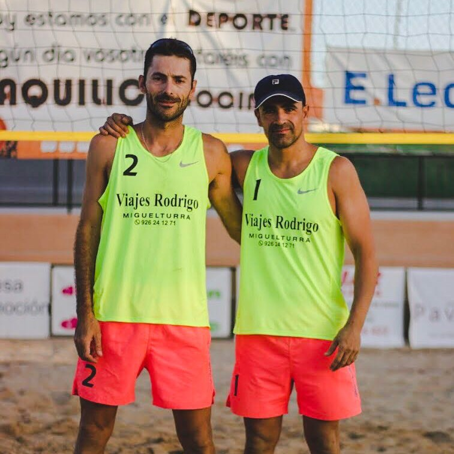
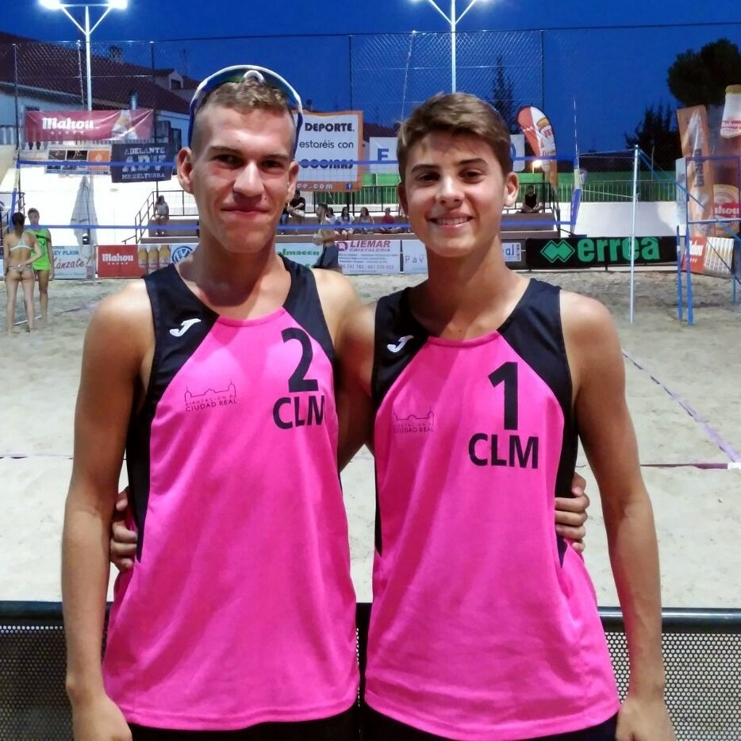
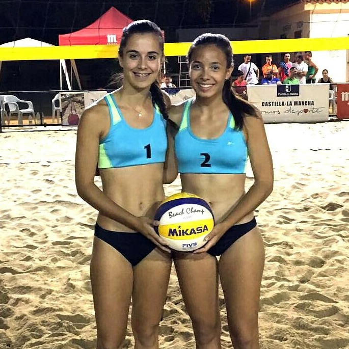
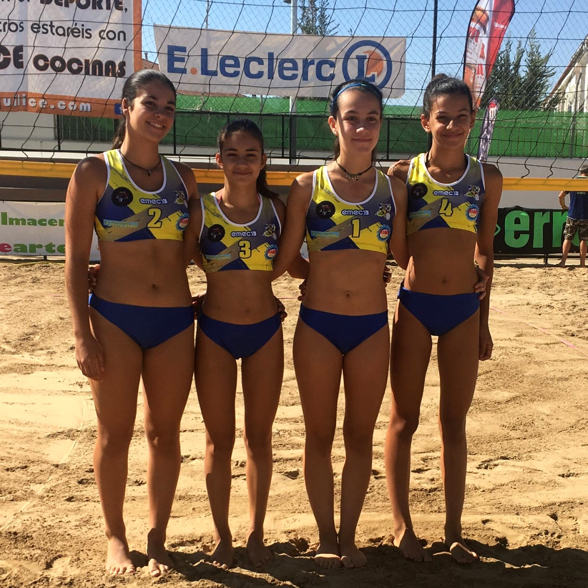
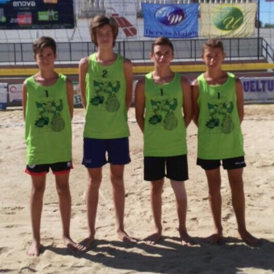

# Campeonato de España 2017

En total, siete Campeonatos de España de las diferentes categorías han
contado con representación miguelturreña y de nuestro club durante
este verano de 2017. El dominio miguelturreño en la mayoría de pruebas
regionales fue palpable y gracias a ello nuestros jugadores y
jugadoras han podido llevar su calidad más allá de las fronteras
castellano-manchegas.

Lo más destacable sin duda, han sido los dos 7º puestos logrados en
Infantil Femenino y en Sub-19 Femenino por Clubes batiendo todos los
registros anteriores. Muy buenas actuaciones también en Sub-19
Masculino por Clubes e Infantil Masculino con 9º puesto en ambos,
resultados que junto a los de las chicas colocan a nuestro club como
uno de los referentes a nivel nacional en Voley Playa. También es
digno de mencionar la participación en el Campeonato de España
Absoluto de Víctor y Tara por tercer año consecutivo, un campeonato
que cada año tiene más nivel y cuesta más acceder.

## Absoluto

 | 
---		| ---
Equipo: | Miguel Astilleros "Tara" y Víctor Muñoz
Puesto: | 21º
Fechas: | 31 de Agosto al 3 de Septiembre
Sede:   | Reserva del Higuerón de Fuengirola (Málaga)
Web: 	| http://www.rfevb.com/campeonato-de-espana-de-voley-playa-2017

Tercera actuación de Víctor y Tara en la principal cita nacional de
Voley Playa con un buen papel a pesar de no haber podido igualar el
resultado del año anterior tras caer derrotados con los melillenses
Alcober/Tahiri. Torneo que, en cambio, les sirve para afianzarse como
dos habituales en la máxima competición de nuestro país.

## Sub-19

### CAMPEONATO DE ESPAÑA DE CLUBES

 | | 
---			| --- | ---
Equipo: 	| Marta Gómez y Lorena Sánchez | Josema Sánchez y Álex Fernández
Entrenador: | Laura Mora 				   | Joaquín González
Puesto: 	| 7º 						   | 9º
Fechas: 	| 17 al 22 de Agosto
Sede: 		| Centro Internacional de Voley Playa de Lorca (Murcia)
Web: 		| http://www.rfevb.com/campeonato-de-espana-voley-playa-sub-19-clubes-2017 |

Gran torneo de ambas parejas miguelturreñas que ante todo consiguen
establecerse como parejas de referencia en su categoría. Lorena y
Marta superaron sus registros hasta la fecha imponiéndose a grandes
clubes como el CVP Poniente Benidorm o el CVP Arenys y desmostrando su
enorme potencial. Por su parte, Álex y Josema también consiguieron
notables victorias y un duro e igualado cruce ante los a la postre 3º
de España, Jealsa Barraña, fue lo que los separó de los puestos de
arriba.

### CAMPEONATO DE ESPAÑA DE SELECCIONES AUTONÓMICAS

Equipo: 	| Ana de la Beldad y Pilar Briñas | Sergio Sobrino y Juanma Ruiz
Entrenador: | Cristian Rodado 				  | Joaquín González
Puesto: 	| 17º 							  | 13º
Fechas: 	| 3 al 8 de Agosto
Sede: 		| Centro Internacional de Voley Playa de Lorca (Murcia)
Web: 		| http://www.rfevb.com/campeonato-de-espana-voley-playa-sub-19-2017

A pesar de las dificultades que siempre plantea la arena de Lorca,
siendo su primera competición allí tanto para nuestros chicos como las
chicas, tanto Sergio y Juanma como Ana y Pilar supieron rehacerse a
complicados comienzos en sus respectivas competiciones y despedirse
con victorias ante Asturias y La Rioja en un campeonato especialmente
formativo y que con toda seguridad dará paso a mejores resultados.

## Infantil

### CAMPEONATO DE ESPAÑA DE CLUBES

Equipo: 	| Raquel Ávila, Amelia Briñas, Elsa Moraga y Lucía Vidal | Kevin Díaz, Marcos Moncada, Daniel Muñoz y Alejandro Rodríguez
Entrenador: | Laura Mora y Fran González 							 | Jesús Nieto y Javier Nieto
Puesto: 	| 7º 													 | 9º
Fechas: 	| 11 al 16 de Agosto
Sede: 		| Centro Internacional de Voley Playa de Lorca (Murcia)
Web: 		| http://www.rfevb.com/campeonato-de-espana-voley-playa-infantil-2017

Muy buenos resultados también para nuestros equipos en la categoría
más joven y que, por tanto, les deja mucho recorrido por delante a
estos chicos y chicas. Las chicas terminaron con un 7º puesto que por
muy poco no fue más alto, ganando todos los partidos excepto los que
las enfrentaron a las campeonas y a las subcampeonas. Los chicos
realizaron una magnífica fase de grupos superando a clubes como Lilla
Grau o CVP Arenys y clasificando para los cruces, donde no pudieron
con Hoteles San José.

