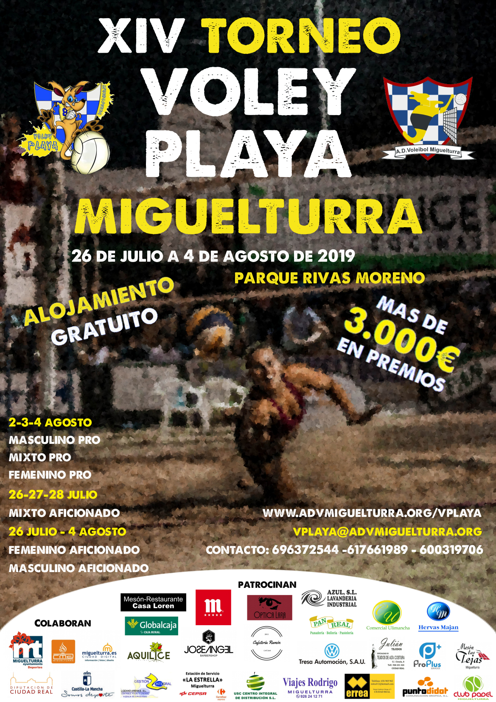

<!--
<aside>
<h3>Secciones</h3>
<a href="inscripcion.jpg">Hoja de Inscripción</a>

<a href="horarios.html">Horario</a>

<a href="clasificacion.html">Grupos y Resultados</a>

<!-- 
<a href="eliminatorias.html">Eliminatorias</a>
 ->

<a href="#juventud">Torneo de la Juventud</a>

Si tienes alguna duda, puedes escribirnos
a <a href="mailto:vplaya@advmiguelturra.org">vplaya@advmiguelturra.org</a>

</aside>
-->

# XIV Torneo Miguelturra de Voley-Playa - 2019

<!-- La duodécima edición del Torneo Miguelturra de Voley-Playa se -->
<!-- celebrará este año del 28 de Julio al 6 de Agosto de 2017. Contaremos -->
<!-- con las nuevas instalaciones para deportes de arena, con gradas -->
<!-- incorporadas, sistema de riego automático y mayor superficie de arena. -->

<!-- Algunas categorías PRO cuentan con una dotación en metálico de más de -->
<!-- 500€ para el ganador. -->

<!-- **El sorteo de los grupos se realizará el día 28 de Julio en las -->
<!-- instalaciones del parque.** -->

<!-- El primer sábado de torneo, día 29 de Julio, se compaginará con la -->
<!-- celebración del Campeonato Regional Senior de Voley-Playa, -->
<!-- clasificatorio para el Campeonato de España. Parejas de toda la región -->
<!-- competirán en Miguelturra por el derecho a representar a Castilla-La -->
<!-- Mancha en el Campeonato nacional. -->

<!--
## Inscripción

El plazo de inscripción queda abierto, hasta el próximo día 27, un día
antes del torneo. Para inscribirte, deberás entregarnos (bien en mano
o por email):

- la [hoja de inscripción](inscripcion.jpg) rellena
- una copia del resguardo bancario justificando el ingreso de la cuota

Todos los datos están detallados en la hoja de inscripción.

Cuotas de inscripción:

 - Masculino y Femenino Pro: 30€ por pareja
 - Resto de categorías: 20€ por pareja

## Categorías

- Masculino Pro
- Femenino Pro
- Mixto Pro
- Aficionado
- Mixto Aficionado (esta categoría sólo compite los días 28, 29 y 30)

## Formato de Competición

Los partidos se disputarán al mejor de 3 sets, de 15 puntos. El tercer
set tendrá un máximo de 11 puntos.

Se limitan las plazas en cada categoría, como sigue:

- MASC: 20 equipos
- FEM: 16 equipos
- MIX: 24 equipos
- AFICIONADOS: 44 equipos
- MIXTO AFI: 16 equipos

Se disputará primero una fase de grupos, estilo liga, pasando después
a la fase de eliminatorias.

Después de la fase de grupos, los mejores clasificados pasarán a la
fase de eliminantorias. A igual cociente de sets, se mirará el
cociente de puntos totales. Si persiste el empate y fuera necesario
deshacerlo, se decidirá a cara o cruz.

Para las eliminatorias, se clasificarán:

- 8 equipos en categoría Masculina Pro
- 8 equipos en categoría Femenina Pro
- 12 equipos en categoría Mixto Pro
- 16 equipos en categoría Aficionados
- 8 equipos en categoría Aficionados Mixto

Las eliminatorias se jugarán a un sólo partido (eliminatoria directa),
y según los cuadros establecidos por la RFEVB.

## VIII Torneo Voley-Playa de la Juventud

Como todos los años el Torneo de la Juventud servirá de telonero al
torneo absoluto, donde cada año encontramos a lo mejor de nuestra
cantera e incluso de las localidades cercanas y en el que los
protagonistas son los más jóvenes, toda la información en el cartel
adjunto:

## Acuerdos Legales

1. La Organización no se hace responsable de cualquier accidente o
   lesión que puedan sufrir los jugadores, quienes reconocen actuar
   por su propia cuenta y riesgo.
1. La Organización se reserva el derecho a tomar fotografías y/o
   vídeos de los participantes durante el torneo. Dichas imágenes
   podrán ser luego utilizadas en medios públicos (incluyendo, pero
   sin limitarse a: internet, cartelería y prensa) con fines
   divulgativos y promocionales de las actividades del ADV
   Miguelturra.
1. Los horarios establecidos en la web y en los paneles informativos
   en el lugar del evento son orientativos, y sujetos a variación por
   las características del torneo y circunstancias ajenas a nuestro
   control. La Organización se reserva el derecho a modificar dichos
   horarios.
1. A pesar de que la Organización se compromete a hacer lo posible
   para adecuar los horarios de juego a las necesidades de cada uno,
   no se garantiza que esto sea siempre posible. La incomparecencia de
   un equipo al inicio del partido podrá suponer la pérdida de ese
   partido por 2-0 (15-0, 15-0).
1. Las disponibilidad de tallas de camisetas está sujeta a la
   existencia de las mismas. No se garantiza la disponibilidad.
1. La formalización de la inscripción en el torneo implica la
   aceptación de estas condiciones.

## Localización

<iframe scrolling="no" marginheight="0" marginwidth="0"
src="https://maps.google.es/maps?t=h&amp;ie=UTF8&amp;ll=38.960393,-3.882521&amp;spn=0.000671,0.001032&amp;z=21&amp;output=embed"
width="700" height="350" frameborder="0">
</iframe>

[Ver mapa más grande](https://maps.google.es/maps?t=h&ie=UTF8&ll=38.960393,-3.882521&spn=0.000671,0.001032&z=21&source=embed)

## Empresas Colaboradoras

-->
